# chat

#### 介绍
本项目是一个聊天项目，目前项目实现了`私聊`跟`群聊`，`更换头像`功能，支持`发送图片、文字以及表情`

#### 安装

1. 克隆项目
2. 执行`npm install`命令安装项目所需依赖包

#### 使用
执行 `npm run start`命令即可

<h6 style="color:red;">注意：运行前还需在项目的根目录下创建一个`.env`文件，为了保护一些隐秘数据，采用了环境变量的方式进行引用，所以请在`.env`文件中设置好以下变量</h6>

    REACT_APP_BASE_URL(api请求的基本路径)
    REACT_APP_KEY9(密码加密的密钥)
    REACT_APP_IV(密钥偏移量)
    REACT_APP_SOCKET_IO(服务端socket.io连接地址)

#### 运行在桌面端
运行前请确保是否已安装了`electron`,若已安装即可执行 `npm run electron`指令

#### 项目预览图

##### PC端
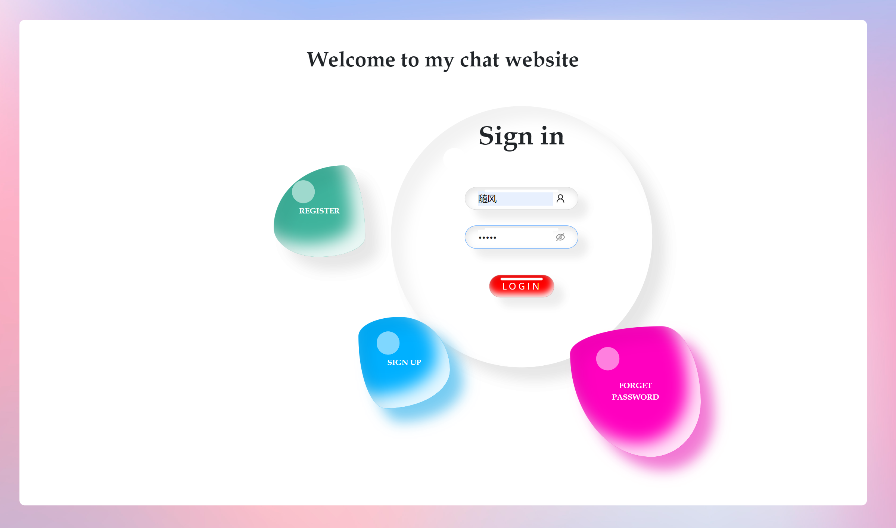
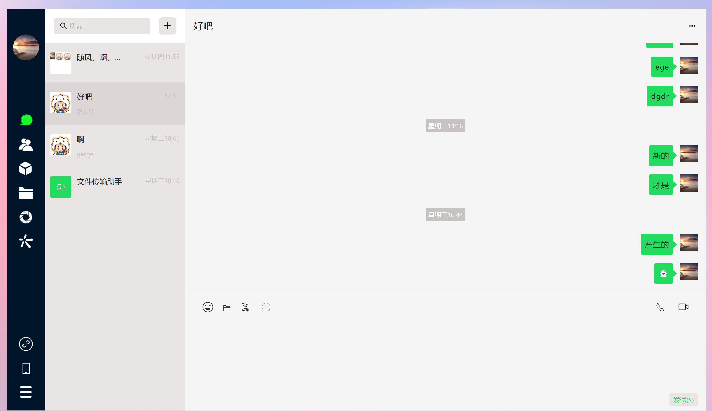
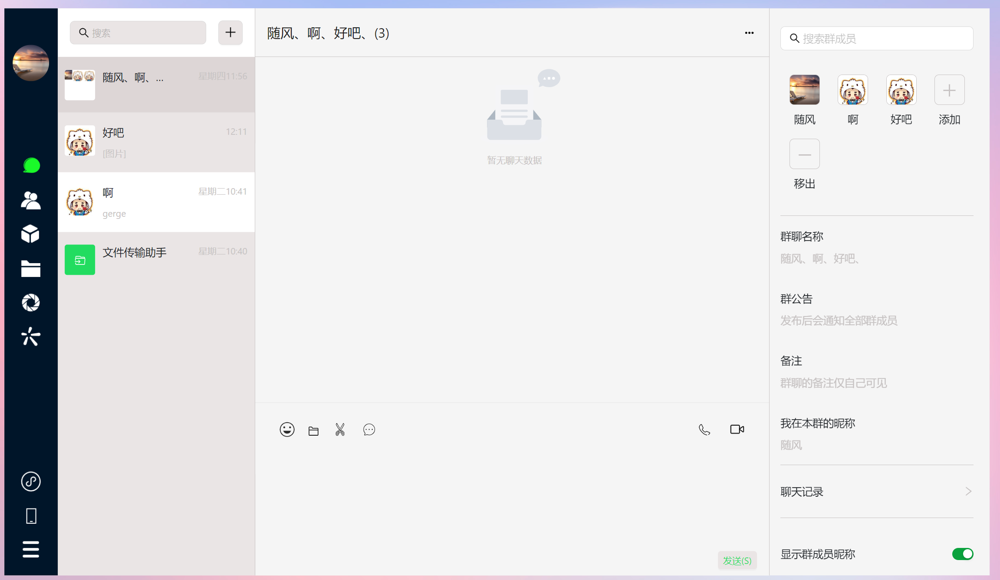
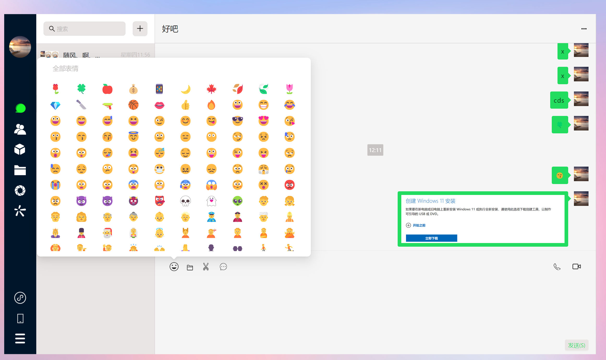

##### 移动端

    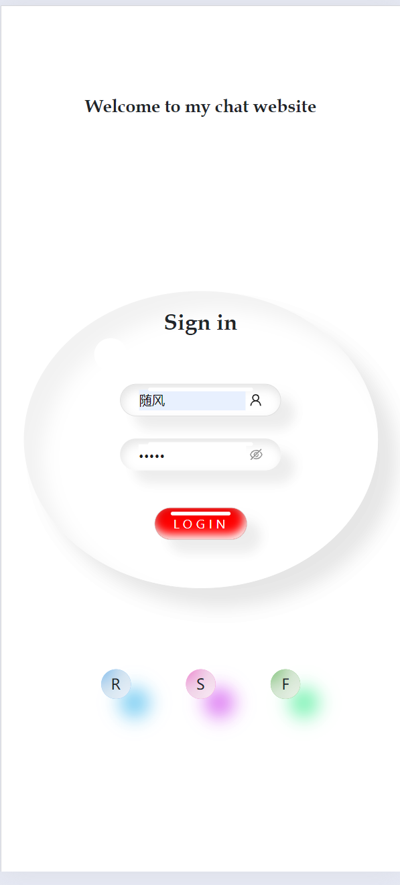
    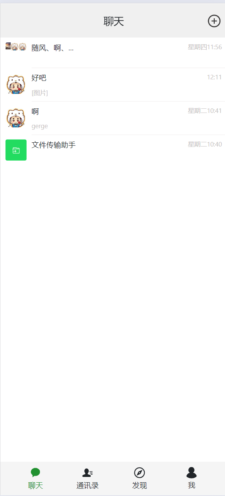
    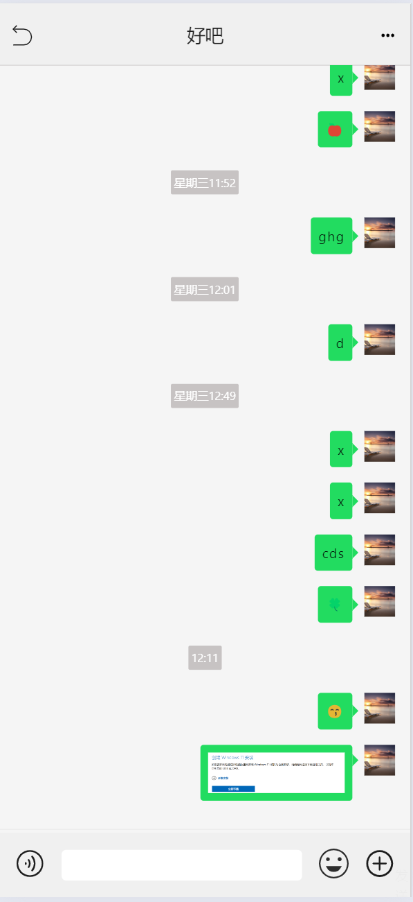
    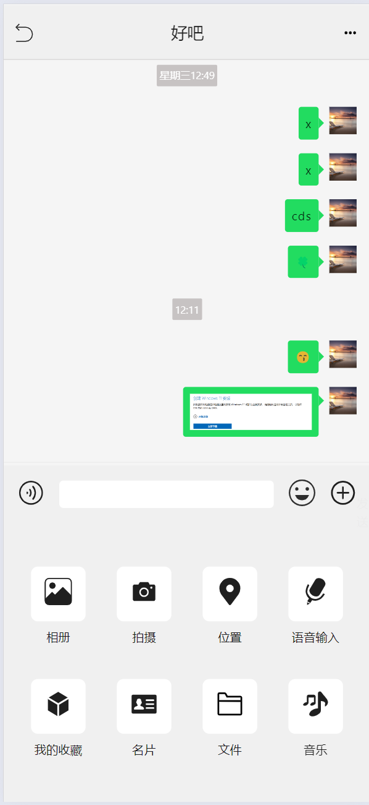
    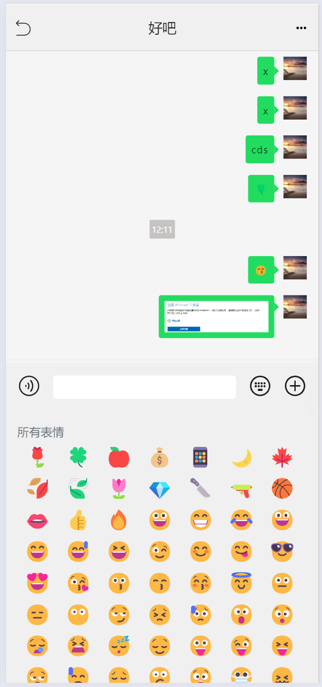
    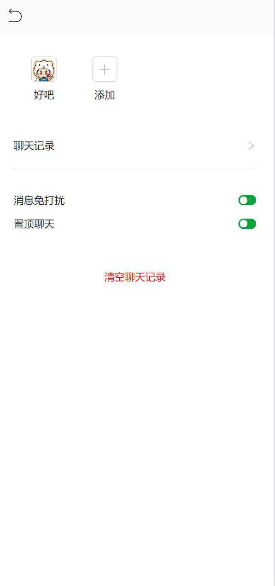
    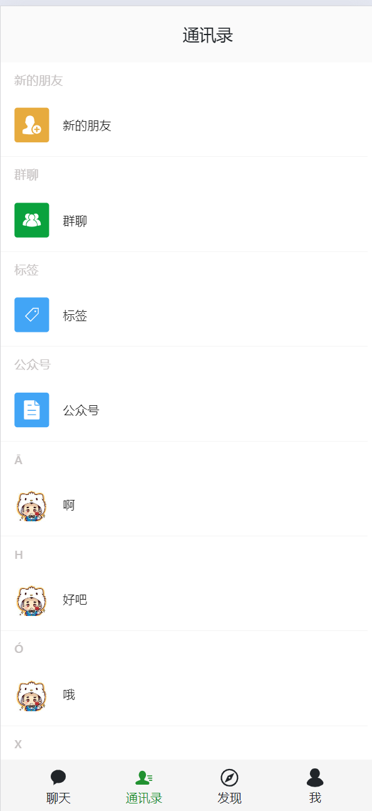

##### 桌面端

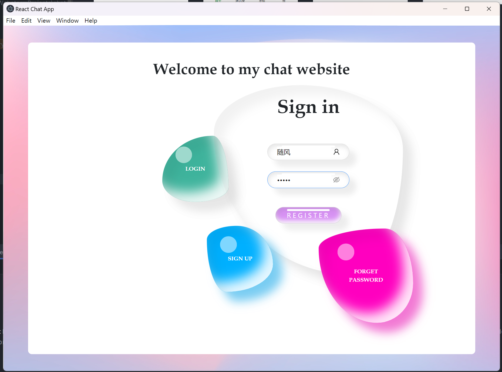
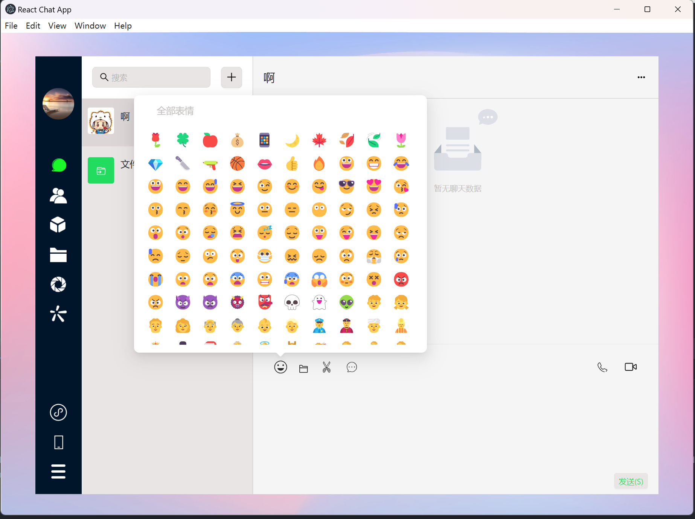
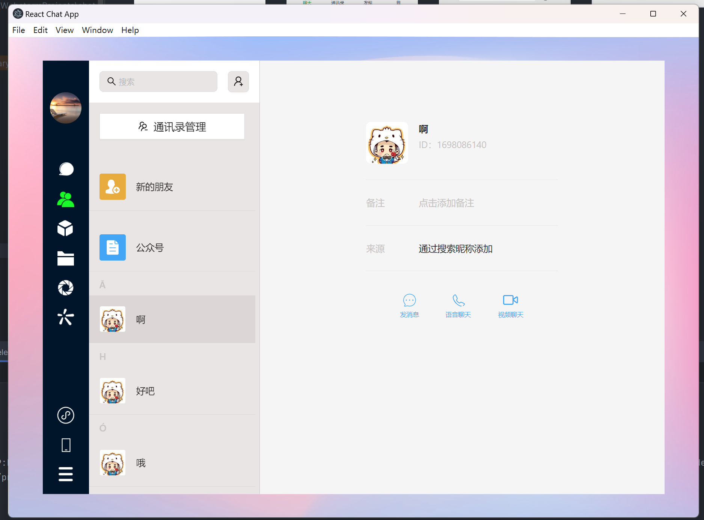